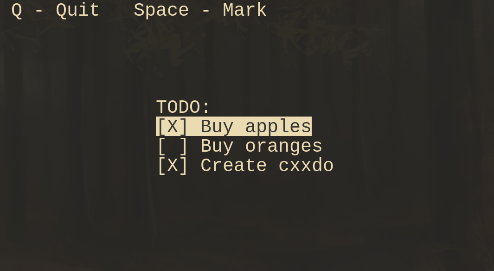

<p align="center">
	<h1 align="center">cxxdo</h2>
	<p align="center">A simple todo editor written in C++</p>
</p>
<p align="center">
	<a href="./LICENSE">
		
	</a>
	<a href="https://github.com/LordOfTrident/cxxdo/issues">
		
	</a>
	<a href="https://github.com/LordOfTrident/cxxdo/pulls">
		
	</a>
	<br><br><br>
	
</p>

## Table of contents
* [Introduction](#introduction)
* [Quickstart](#quickstart)
* [Format](#format)
* [Bugs](#bugs)
* [Dependencies](#dependencies)
* [Make](#make)

## Introduction
A simple todo editor that can view todos in a file and check/uncheck them.

## Quickstart
```sh
$ make
$ ./bin/app FILENAME
```
See `./bin/app -h` for help.

## Format
A simple todo example:
```
[X] Buy apples
[ ] Buy oranges
```

A dash in front of the todo is acceptable:
```
- [X] Buy apples
- [ ] Buy oranges
```

The checked character is case-insensitive (both `x` and `X` are valid).
If the box isnt checked, the character can either be a space (` `) or a dot (`.`)
```
[x] Buy apples
[.] Buy oranges
```

> All lines in a file that are not todos are ignored and their parsing error is logged into `stderr`

## Bugs
If you find any bugs, please create an issue and report them.

## Dependencies
- [ncurses](https://en.wikipedia.org/wiki/Ncurses)

## Make
Run `make all` to see all the make rules.
